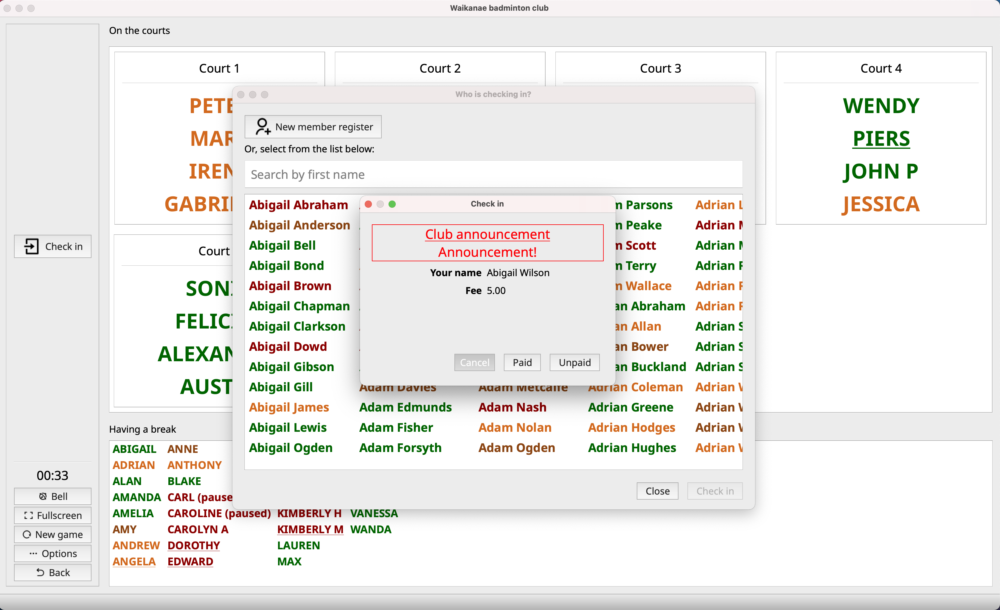

# Game making app for court-based sports

## What this?
This app organises game players for a fair and fun game. It's ideal for sports like:

- Badminton
- Tennis
- Table tennis

## What does it do?

Given a number of courts and some players, it will arrange the game based on:
1. Matching experience levels
2. Fair opportunities
3. Matching gender
4. Opponent/companion uniqueness

## What are the features?

- New member registration
- Check in/out member
- Basic fee management (mark paid/unpaid)
- Pause/resume playing
- Update player's level

## Who's using this?

* [Waikanae badminton club](https://www.facebook.com/waikanaebadminton/)

## FAQ

### There is no Wi-Fi at where I play, can I use this app offline?
Yes. This app doesn't require internet.

### Can I use it for free?
Yes. This software is open-source and free for everyone to use.

### Can I use it in a commercial setting?
Yes. Community support only.

### I want to add X/Y/Z to the software
Please open an issue. PR welcome. 
If you want priority fix/issue, I can provide a paid service.

## Screenshots

### Playing board
Showing who's playing and who's on the bench.

### Checking in
Guest can check in anytime. They will also see club announcement.

### Player stats
Showing all games a player has been played and its match quality.

### Club report
Generate a report for club use. Like payment history.

## License
MIT License